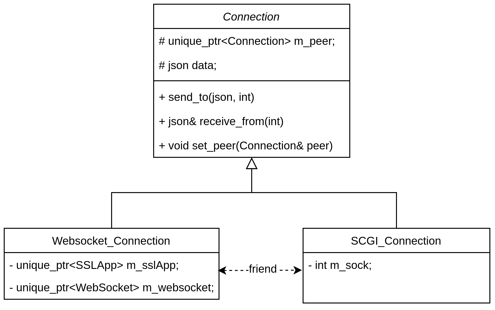
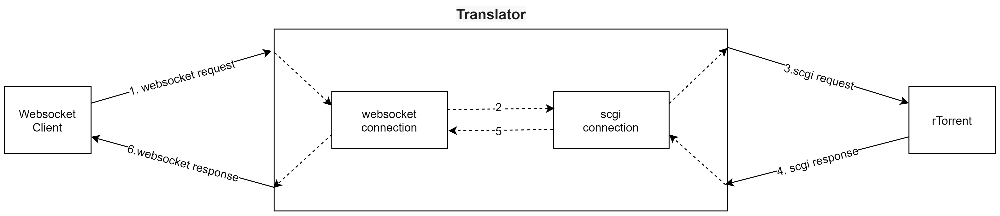
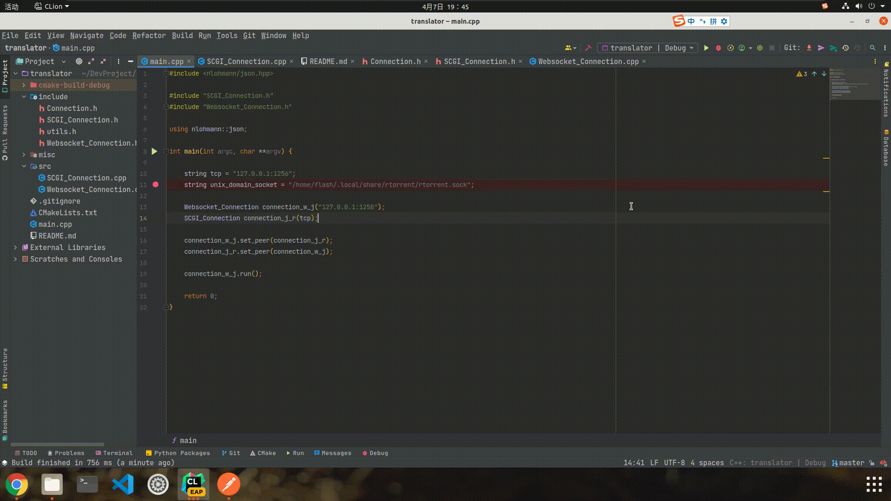

# Overview

This project implements a "translator", which takes JSON arguments from Websocket client, reformat it into SCGI and forward it to rTorrent, waiting response from rTorrent and then pass the response to the websocket client. 

There are two main concepts in the project, websocket connection and scgi connection. The former works as a "server" to wait for websocket client to connect and takes the JSON message from the client, and then pass the message to the latter. The latter takes the JSON message, wrapped it into scgi format and then send to rTorrent, send the response from rTorrent to websocket connection, which send it to the websocket client. As the saying goes, "Any problem in computer science can be solved by another layer of indirection", websocket connection is such an "another layer of indirection".

# Class Design & Data Flow

There are specific comments in the code, straightforward to understand, class design overview is shown below:

The following picture shows the process of data flow

# Dependency

[uWebsockets](https://github.com/uNetworking/uWebSockets) is used in this project to implement "Websocket Connection", so you must make uWebsockets and its dependency(uSockets, openssl, zlib, etc) ready in your dev machine. Noted that wss (websockets with ssl) are used here so you have to compile uWebsockets with ssl option (WITH_OPENSSL=1 make). You can take a look at my [blog](https://flash-flash.gitee.io/2022/03/27/uWebsockets%20%E7%BC%96%E8%AF%91%E5%AE%89%E8%A3%85/) if you have problem on compiling and install uWebsockets and uSockets.

# Build

The project can build with CMake easily

`git clone https://github.com/Young-Flash/translator.git`

`cd translator`

`mkdir build && cd build`

`cmake ..`

`make`

`./translator`

# Run

You can use [Postman](https://www.postman.com/) as websocket client to access the "Websocket Connection" and send JSON message to it easily.

